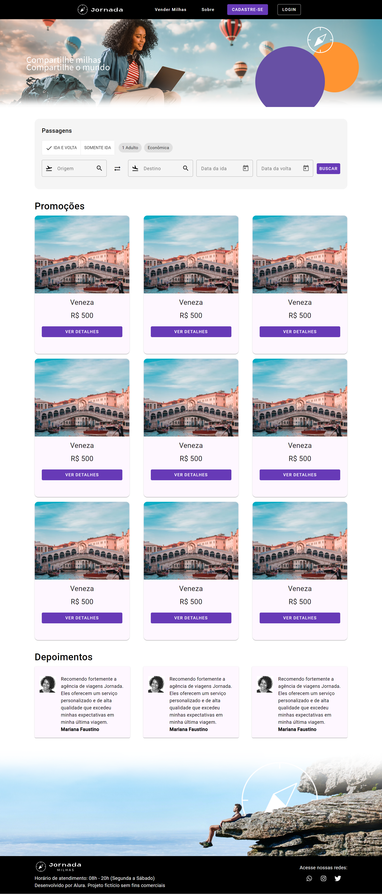

# Aplicação Jornada Milhas

### Esta aplicação foi desenvolvida no curso `Angular: Componentização e design com Angular Material` da plataforma Alura

This project was generated with [Angular CLI](https://github.com/angular/angular-cli) version 16.0.1.

## Criação do projeto

- `npm install -g @angular/cli@16.0.0.`;
- `ng new jornada-milhas`;
- `ng server --open`.

## Sobre o projeto

- Angular e Material Design;
- O Material é um a biblioteca que fornece componebtes e diretivas que podem ser utilizados nos projetos para criação de um visual consistente;
- <a href="https://material.angular.io/">Documentação do Angular Material</a>;
- Instalação de angular material `ng add @angular/material`;
- Diretiva `ng-content`, permite a criação de pontos de inserção de conteúdo dinâmico em diversos tipos de componentes `<ng-content></ng-content>`;
- O ng-content é uma diretiva do Angular que permite a criação de componentes flexíveis e reutilizáveis, capazes de receber e exibir conteúdo dinâmico. É uma ferramenta poderosa para criar componentes genéricos que podem se adaptar a diferentes necessidades de conteúdo;
- Ao usar o ng-content em conjunto com o select, você pode criar componentes altamente customizáveis, capazes de receber e exibir múltiplos tipos de conteúdo de forma dinâmica;
- Na aplicação foram utilizados Cards reaproveitáveis com variação de estilos;
- Card de busca utilizando o `mat-card` do Angular Material;
- Utilização de componentes de chips e `button-toggle` do Angular Material;
- Inclusão de Ícones do Material Design;
- Construção de campos de data com o `datepicker` do Angular Material;
- Criação de um componente de `modal` com o `MatDialog`;

## Estilização

- SCSS
- O SCSS é um pré-processador de CSS;
- A partir dele é possível expandir as funcionalidades do CSS, assim como os seletores alinhados.
